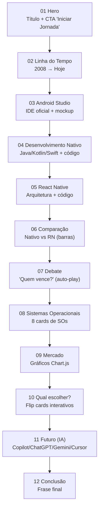
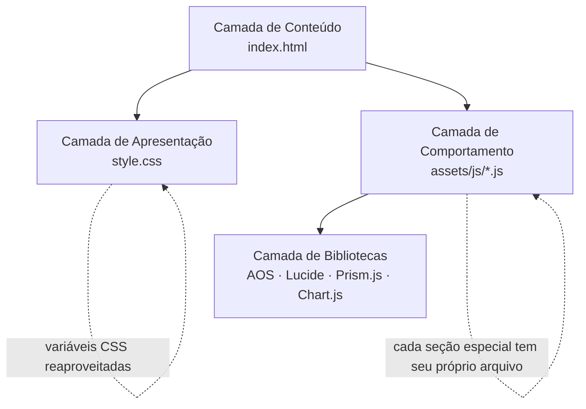

# 00 — Visão Geral do Projeto

> Leia este arquivo primeiro. Ele é o "mapa" de tudo o que existe no projeto e de como as peças se encaixam. Os demais arquivos da pasta `docs/` aprofundam cada tópico citado aqui.

## 1. O que é este projeto

É um **sitema de apresentação (one-page, scroll-driven)** feito para a disciplina de Desenvolvimento de Software Multiplataforma. Ele substitui um PowerPoint tradicional: em vez de trocar de slide clicando, os apresentadores **rolam a página** e cada seção (quase do tamanho da tela inteira) revela um bloco do conteúdo com animações.

O tema do conteúdo é **"A Evolução do Desenvolvimento Mobile"**: da programação nativa (Java/Kotlin/Swift) até o desenvolvimento multiplataforma (React Native, Flutter) e o papel da IA hoje.

Tecnicamente, é um site estático feito com:

- **HTML5** puro (`index.html`) — estrutura e conteúdo.
- **CSS3** puro (`assets/css/style.css`) — todo o visual (tema escuro, glassmorphism, animações).
- **JavaScript puro** (vários arquivos em `assets/js/`) — interatividade, sem frameworks como React ou Vue.
- Bibliotecas leves carregadas via CDN: **AOS** (animações de scroll), **Prism.js** (realce de código), **Chart.js** (gráficos), **Lucide** (ícones).

Não existe backend, banco de dados ou build step (Webpack/Vite). Basta abrir o `index.html` em um navegador.

## 2. Como a aplicação funciona (visão de 30.000 pés)

1. O navegador carrega `index.html`.
2. O HTML referencia o `style.css` (que já deixa tudo estilizado) e, no final do `<body>`, uma sequência de `<script>` (bibliotecas externas + arquivos próprios do projeto).
3. Quando o DOM termina de carregar, cada arquivo JavaScript "se inscreve" no evento `DOMContentLoaded` e liga sua própria funcionalidade (ver [04-javascript.md](./04-javascript.md)).
4. Conforme o usuário rola a página, três mecanismos de animação atuam em paralelo:
   - **CSS puro** (`@keyframes`, `transition`) para animações que não dependem de dado nenhum (ex.: blobs do Hero flutuando).
   - **AOS** (biblioteca externa) para o clássico "fade/zoom ao entrar na tela", ativado via atributos `data-aos` no HTML.
   - **JavaScript customizado** (`IntersectionObserver`) para lógicas mais específicas que o AOS não cobre: preencher a barra da timeline, animar barras de comparação, tocar a sequência do debate, criar os gráficos do Chart.js no momento certo.
5. Não há nenhuma "página 2" — é tudo uma única página (`index.html`) com 12 `<section>` empilhadas verticalmente dentro de `<main>`.

## 3. Fluxo da experiência (as 12 seções, em ordem)

Cada bloco dessa lista é uma `<section class="section ...">` dentro de `index.html`. Todas compartilham a classe `.section`, que define "ocupar quase a tela inteira e centralizar o conteúdo" (ver [03-css.md](./03-css.md)).

## 4. Como os arquivos conversam entre si

```mermaid
flowchart LR
    subgraph HTML["index.html"]
        direction TB
        H1["12 &lt;section&gt; dentro de &lt;main&gt;"]
        H2["Atributos: id, class, data-aos, data-tilt, data-android/data-rn"]
    end

    subgraph CSS["assets/css/style.css"]
        C1["Design tokens (variáveis)"]
        C2["Reset"]
        C3["Layout .section"]
        C4["Estilo por seção (01 a 12)"]
        C5["Componentes compartilhados<br/>(.code-window, .feature-card...)"]
    end

    subgraph JS["assets/js/*.js"]
        J1["main.js — orquestrador geral"]
        J2["timeline.js"]
        J3["comparison.js"]
        J4["debate.js"]
        J5["charts.js"]
        J6["quiz.js"]
    end

    subgraph EXT["Bibliotecas externas (CDN)"]
        E1["AOS"]
        E2["Lucide"]
        E3["Prism.js"]
        E4["Chart.js"]
    end

    HTML -- "classes/ids são o contrato" --> CSS
    HTML -- "ids/seletores são o contrato" --> JS
    JS -- "lê atributos data-*" --> HTML
    JS -- "cria elementos e classes<br/>(ex: .is-active, .aos-animate)" --> HTML
    EXT -- "lidas via CDN, controladas por main.js/charts.js" --> JS
```

**A ideia-chave**: HTML, CSS e JS **não se importam uns aos outros como módulos** (não é React). Eles se comunicam por um "contrato implícito": nomes de `id`, `class` e atributos `data-*`. Por exemplo:

- O HTML tem `
`.
- O CSS estiliza `.timeline__progress` (a altura começa em `0%`).
- O JS (`timeline.js`) faz `document.getElementById('timelineProgress')` e muda `style.height` em tempo real.

Se você renomear um `id` ou uma `class` em um arquivo sem atualizar os outros dois, a funcionalidade quebra silenciosamente (sem erro no console, na maioria dos casos). Isso é importante para debugar: **sempre procure o mesmo nome nos três arquivos**.

## 5. Arquitetura geral (camadas)

Essa separação é conhecida como **separação de responsabilidades** (*separation of concerns*):

| Camada | Responsabilidade | Não deveria fazer |
|---|---|---|
| HTML | Estrutura e conteúdo semântico | Estilo inline extenso, lógica complexa |
| CSS | Aparência, layout, animações declarativas | Manipular conteúdo/texto |
| JS | Comportamento, interatividade, animações que dependem de estado/scroll | Guardar textos longos que poderiam estar no HTML |

## 6. Por que não usamos React/Vue/Angular?

por que o **HTML5 + CSS3 + JavaScript puro** (chamado de *Vanilla JS*), com bibliotecas leves apenas para efeitos pontuais (animação de scroll, gráficos, ícones, realce de código). Isso tem uma vantagem didática: **dá para entender 100% do código sem aprender um framework antes** — é só abrir os arquivos e ler.

## 7. Por onde continuar a leitura

1. [01-project-structure.md](./01-project-structure.md) — onde cada arquivo mora e por quê.
2. [02-html.md](./02-html.md) — cada `<section>` explicada em detalhe.
3. [03-css.md](./03-css.md) — como o visual é construído.
4. [04-javascript.md](./04-javascript.md) — cada arquivo `.js`, praticamente linha a linha.
5. [05-components.md](./05-components.md) — os "blocos de Lego" reutilizáveis (code-window, feature-card, etc.).
6. [06-animations.md](./06-animations.md) — catálogo de todas as animações e como cada uma foi feita.
7. [07-best-practices.md](./07-best-practices.md) — decisões de qualidade de código tomadas no projeto.
8. [08-learning-notes.md](./08-learning-notes.md) — conceitos de JS/CSS usados aqui, explicados para quem está aprendendo.
9. [glossary.md](./glossary.md) — dicionário de todos os termos técnicos usados na documentação.
