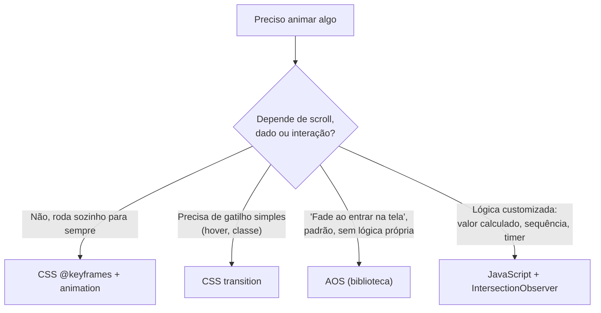

# 06 — Catálogo de Animações

O site usa **quatro mecanismos diferentes** de animação, cada um escolhido para o tipo de efeito mais adequado. Este documento explica cada mecanismo e cataloga onde cada animação específica é usada.

## Os 4 mecanismos



| Mecanismo | Quando usar | Exemplos no projeto |
|---|---|---|
| `@keyframes` + `animation` | Efeito contínuo, sem gatilho externo, roda "para sempre" | Blobs do Hero, pulso do dot "Hoje", pulso do diagrama RN, flutuação dos cards de IA |
| `transition` | Mudar suavemente entre 2 estados, disparado por `:hover` ou classe JS | Hover de cards, dots de navegação, largura das barras de comparação |
| **AOS** (biblioteca externa) | "Fade/zoom ao rolar até aqui" — o caso mais comum do site | A maioria dos títulos, cards e blocos de texto |
| JavaScript customizado | O efeito depende de um cálculo (posição de scroll, dado de `data-*`) ou de uma sequência temporal | Barra da timeline, debate automático, gráficos, tilt 3D |

---

## 1. CSS `@keyframes` — animações contínuas e autônomas

### Blobs do Hero (`blobFloat`)
```css
@keyframes blobFloat {
  from { transform: translate(0, 0) scale(1); }
  to   { transform: translate(6%, 8%) scale(1.15); }
}
.hero__blob--1 { animation: blobFloat 16s ease-in-out infinite alternate; }
.hero__blob--2 { animation: blobFloat 20s ease-in-out infinite alternate-reverse; }
```
Dois gradientes desfocados (blur de 90px) se movem lentamente, criando uma sensação de "ambiente vivo" no fundo do Hero. Cada blob tem uma **duração diferente** (16s vs. 20s) e uma **direção diferente** (`alternate` vs. `alternate-reverse`) de propósito — se ambos tivessem o mesmo timing, o movimento pareceria mecânico/sincronizado; com timings diferentes, o padrão nunca se repete de forma óbvia.

### Reveal do texto do Hero (`revealUp`)
```css
@keyframes revealUp {
  from { opacity: 0; transform: translateY(24px); }
  to   { opacity: 1; transform: translateY(0); }
}
.hero__eyebrow  { animation: revealUp 0.8s var(--transition-base) 0.1s forwards; }
.hero__title-line:nth-child(1) { animation-delay: 0.25s; }
.hero__title-line:nth-child(2) { animation-delay: 0.45s; }
.hero__subtitle { animation: revealUp 0.8s var(--transition-base) 0.65s forwards; }
.hero__cta      { animation: revealUp 0.8s var(--transition-base) 0.85s forwards; }
```
Este é o único lugar do site onde a entrada é feita **inteiramente em CSS puro**, sem AOS nem JavaScript — porque o Hero é a primeira coisa que aparece ao carregar a página, então a animação deve rodar **imediatamente ao carregar**, e não "quando entra na tela" (o Hero já está na tela desde o início). Cada elemento usa a mesma animação (`revealUp`), mas com um `animation-delay` diferente e crescente (`0.1s → 0.25s → 0.45s → 0.65s → 0.85s`), criando uma cascata onde cada linha de texto aparece um pouco depois da anterior. `forwards` é o que garante que o elemento **permaneça** no estado final (`opacity: 1`) depois que a animação termina — sem isso, o CSS voltaria ao estado original (`opacity: 0`, definido fora do `@keyframes`) assim que a animação acabasse.

### Indicador de scroll (`scrollDot`)
```css
@keyframes scrollDot {
  0%   { top: 6px; opacity: 1; }
  60%  { opacity: 0; }
  100% { top: 20px; opacity: 0; }
}
```
A bolinha dentro da "cápsula" de scroll do Hero desce e desaparece, repetindo em loop — um padrão visual universalmente reconhecido como "role para baixo".

### Pulso do marco "Hoje" na timeline (`pulseDot`)
```css
@keyframes pulseDot {
  0%, 100% { box-shadow: 0 0 0 0 rgba(168, 85, 247, 0.45); }
  50%      { box-shadow: 0 0 0 10px rgba(168, 85, 247, 0); }
}
.timeline__item--now .timeline__dot { animation: pulseDot 1.8s ease-in-out infinite; }
```
Anima apenas o `box-shadow` (um "anel" que expande e desaparece) — uma técnica clássica para simular um pulso de rádio/sonar, aplicada só ao último marco da timeline ("Hoje"), para diferenciá-lo visualmente dos marcos históricos "fechados".

### Pulso de dados na arquitetura React Native (`pulseMove`)
```css
@keyframes pulseMove {
  0%   { left: 0%;   opacity: 0; }
  10%  { opacity: 1; }
  90%  { opacity: 1; }
  100% { left: 100%; opacity: 0; }
}
.rn-arch__pulse { animation: pulseMove 2.4s linear infinite; }
```
Um pontinho viaja da esquerda para a direita dentro do "conector" entre os nós JavaScript → Bridge → Nativo, simbolizando dados trafegando pela ponte (bridge) do React Native. Aparece com fade-in nos primeiros 10% do trajeto e fade-out nos últimos 10%, para não "nascer" e "morrer" abruptamente nas pontas.

### Flutuação dos cards de IA (`floatCard`)
```css
@keyframes floatCard {
  0%, 100% { transform: translateY(0); }
  50%      { transform: translateY(-8px); }
}
.future-card { animation: floatCard 4.5s ease-in-out infinite; }
.future-card:nth-child(2) { animation-delay: 0.3s; }
.future-card:nth-child(3) { animation-delay: 0.6s; }
.future-card:nth-child(4) { animation-delay: 0.9s; }
```
Os 4 cards da seção Futuro sobem e descem 8px continuamente. Os `animation-delay` diferentes (via `:nth-child`) fazem cada card "flutuar" fora de sincronia com os outros — sem isso, os 4 subiriam e desceriam ao mesmo tempo, parecendo um bloco único e mecânico em vez de 4 elementos "vivos" independentes.

---

## 2. CSS `transition` — mudanças de estado suaves

`transition` **não anima sozinha**: ela só suaviza a mudança de um valor para outro, quando esse valor muda por qualquer motivo (hover, classe adicionada via JS, media query, etc.).

### Hover genérico de cards
```css
.feature-card { transition: var(--transition-fast); }
.feature-card:hover {
  border-color: var(--border-glass-strong);
  background: rgba(255, 255, 255, 0.06);
  box-shadow: 0 12px 32px rgba(0, 0, 0, 0.35);
}
```
Padrão repetido em `.feature-card`, `.os-card`, `.flip-card__face--front`: ao passar o mouse, a borda fica mais visível, o fundo clareia levemente e surge uma sombra — dá uma sensação de "elevação" (o card parece se aproximar do usuário).

### Dots de navegação
```css
.nav-dots__dot {
  transition: var(--transition-fast);
}
.nav-dots__dot.is-active {
  background: var(--gradient-accent);
  height: 24px;
  border-radius: 3px;
}
```
Quando `main.js` adiciona a classe `.is-active` (ver [04-javascript.md](./04-javascript.md#initnavdots)), o dot circular de `8px` se transforma suavemente em uma pílula de `24px` — a `transition` interpola tanto a `height` quanto o `border-radius` e a `background` ao mesmo tempo.

### Barras de comparação
```css
.comparator__fill {
  width: 0%;
  transition: width 1.1s cubic-bezier(0.16, 0.84, 0.44, 1);
}
```
Aqui a `transition` é o que faz a mágica visual do gráfico de barras divergente da seção 06: o JavaScript (`comparison.js`) só define o valor final (`element.style.width = '100%'`), e é a `transition` que faz a barra **crescer visivelmente** de `0%` até esse valor, ao longo de 1.1 segundos.

### Flip card
```css
.flip-card__inner {
  transition: transform 0.6s cubic-bezier(0.16, 0.84, 0.44, 1);
}
.flip-card.is-flipped .flip-card__inner {
  transform: rotateY(180deg);
}
```
Ver seção "Flip 3D" abaixo para a explicação completa do efeito.

### Fade cruzado da pergunta do debate
```css
.battle__question {
  transition: opacity 0.3s ease;
}
.battle__question.is-fading {
  opacity: 0;
}
```
`debate.js` adiciona/remove `.is-fading` para criar o efeito de crossfade — ver [04-javascript.md](./04-javascript.md#assetsjsdebatejs) para o encadeamento completo com `setTimeout`.

---

## 3. AOS (Animate On Scroll) — o "fade padrão" do site

AOS é usado via **atributos no HTML**, sem precisar escrever nenhum CSS ou JS adicional para cada elemento:

```html
<p class="section-eyebrow" data-aos="fade-up">...</p>
<h2 class="section-heading" data-aos="fade-up" data-aos-delay="80">...</h2>
<div class="feature-card" data-aos="zoom-in" data-aos-delay="0">...</div>
```

- `data-aos="fade-up"` — o tipo de animação (a biblioteca já vem com vários prontos: `fade-up`, `fade-down`, `fade-left`, `fade-right`, `zoom-in`, etc.).
- `data-aos-delay="80"` — atraso em milissegundos antes da animação começar (usado para criar cascatas dentro da mesma seção, como visto nos cards de feature: `0`, `80`, `160`, `240`).

**Como funciona por baixo dos panos**: `AOS.init()` (chamado em `main.js`) registra um `IntersectionObserver` interno para **cada** elemento com `data-aos` na página. Quando o elemento entra na viewport, a biblioteca adiciona a classe `aos-animate` a ele; o CSS do AOS (carregado via `aos.css`) já contém as regras que transformam essa classe em uma transição visual (opacidade, transformação).

**Por que isso importa para o resto do projeto**: como o AOS adiciona `aos-animate` ao elemento, esse "gancho" pode ser **reaproveitado no nosso próprio CSS**, sem precisar de JavaScript extra. É exatamente isso que acontece na timeline:
```css
.timeline__item.aos-animate .timeline__dot {
  background: var(--gradient-accent);
  border-color: transparent;
  box-shadow: 0 0 16px rgba(168, 85, 247, 0.5);
  transform: scale(1.15);
}
```
Quando o AOS marca um `.timeline__item` como animado, **nosso** CSS (não o do AOS) reage a essa mesma classe para "acender" o dot correspondente — uma forma elegante de sincronizar um efeito customizado com o timing que o AOS já está controlando, sem duplicar lógica de scroll em JavaScript.

**Onde AOS é usado**: praticamente todas as seções (02 a 12), nos cabeçalhos, cards, blocos de código, etc. — é o "efeito padrão" do site. Os quatro casos que **não** usam AOS e têm uma solução própria (Hero, timeline, comparação, debate, gráficos, tilt) estão descritos na seção seguinte, por terem uma necessidade que o AOS sozinho não cobre.

---

## 4. JavaScript customizado — quando o padrão não é suficiente

### Barra de progresso da Timeline
Não é um "fade ao entrar" — é um **valor contínuo** (a altura da barra) que precisa ser recalculado a cada pixel de scroll, proporcional à posição exata da trilha na tela. Só JavaScript resolve isso. Detalhes matemáticos em [04-javascript.md](./04-javascript.md#assetsjstimelinejs).

### Barras divergentes da Comparação
Tecnicamente **poderia** ter sido feito só com AOS (revelar a barra ao entrar na tela) — mas o valor final de cada barra (`data-android`, `data-rn`) é **dinâmico por linha**, algo que o AOS não tem como saber ler do HTML sozinho. Por isso, `comparison.js` usa `IntersectionObserver` diretamente e aplica o valor via JS, deixando a suavização por conta da `transition` do CSS (mecanismo 2 + 4 combinados).

### Sequência do Debate
Uma animação com **estado e tempo** (4 perguntas, cada uma trocando após um intervalo, terminando em um resultado) — isso é lógica de programa, não um efeito visual isolado. É o caso mais "de aplicativo" (e não "de site") do projeto: usa variáveis de controle (`started`, `index`), `setInterval`, `setTimeout` e `clearInterval` em conjunto. Ver o passo a passo completo em [04-javascript.md](./04-javascript.md#assetsjsdebatejs).

### Gráficos Chart.js
A "animação" aqui é inteiramente da biblioteca Chart.js (rotação do doughnut, crescimento das barras) — o papel do nosso JavaScript é só **decidir o momento certo** de criar o gráfico (quando o `<canvas>` entra na tela), para que a plateia veja a animação acontecer, e não um gráfico já parado.

### Tilt 3D
```javascript
el.addEventListener('mousemove', (e) => {
  const rect = el.getBoundingClientRect();
  const x = (e.clientX - rect.left) / rect.width - 0.5;
  const y = (e.clientY - rect.top) / rect.height - 0.5;
  el.style.transform = `perspective(800px) rotateY(${x * maxTilt}deg) rotateX(${-y * maxTilt}deg)`;
});
```
Esse efeito depende da **posição em tempo real do cursor do mouse** — não existe forma de fazer isso em CSS puro (não há um seletor `:mouse-position` em CSS). É por isso que `initTilt()` existe em `main.js`. Presente em qualquer elemento com o atributo `[data-tilt]`: o mockup da IDE (03), os blocos de código (04, 05), o diagrama de arquitetura (05) e os cards de sistema operacional (08).

**Como funciona**: a cada movimento do mouse sobre o elemento, calcula a posição relativa do cursor (de -0.5 a +0.5, sendo 0 o centro) e converte isso em graus de rotação em dois eixos (`rotateY` para o eixo horizontal do mouse, `rotateX` para o vertical, com sinal invertido para o movimento parecer natural). O CSS de cada elemento com tilt já define `transform-style: preserve-3d`, necessário para o `perspective()` funcionar corretamente.

---

## Flip 3D (detalhe técnico completo)

O card giratório da seção 10 é o efeito mais elaborado de CSS 3D do projeto. Ele usa 3 propriedades que sempre andam juntas:

```css
.flip-card { perspective: 1200px; }

.flip-card__inner {
  transform-style: preserve-3d;
  transition: transform 0.6s cubic-bezier(0.16, 0.84, 0.44, 1);
}
.flip-card.is-flipped .flip-card__inner {
  transform: rotateY(180deg);
}

.flip-card__face {
  position: absolute;
  inset: 0;
  backface-visibility: hidden;
}
.flip-card__face--back {
  transform: rotateY(180deg);
}
```

- **`perspective: 1200px`** (no contêiner externo) — define "a que distância o observador está da cena 3D". Quanto menor o valor, mais exagerada/dramática fica a perspectiva; `1200px` é um valor moderado, dando profundidade sem distorcer demais.
- **`transform-style: preserve-3d`** (no elemento que gira) — sem isso, o navegador "achataria" a rotação 3D em 2D, perdendo o efeito.
- **`position: absolute; inset: 0;`** nas duas faces — faz frente e verso ocuparem **exatamente o mesmo espaço**, sobrepostos um ao outro (é isso que faz parecer "uma carta com dois lados", em vez de dois elementos separados lado a lado).
- **`backface-visibility: hidden`** — esconde uma face quando ela está "de costas" para a tela. Sem essa propriedade, ao girar, você veria o verso da carta **espelhado** (invertido horizontalmente) por trás da frente, em vez de escondido.
- **A face de trás já nasce virada** (`transform: rotateY(180deg)`) — truque para que, quando o `.flip-card__inner` girar 180°, a face de trás "desvire" e fique de frente para a tela, enquanto a da frente "vira" e fica escondida (graças ao `backface-visibility`).

O clique (`quiz.js`) só faz uma coisa: `card.classList.toggle('is-flipped')`. Toda a coreografia 3D acima é inteiramente CSS.
